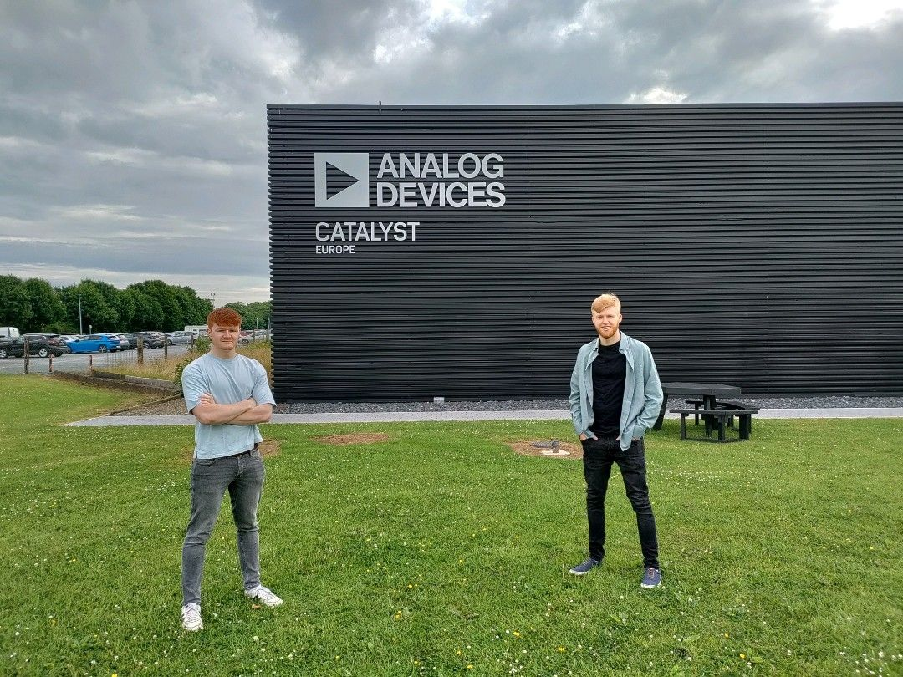
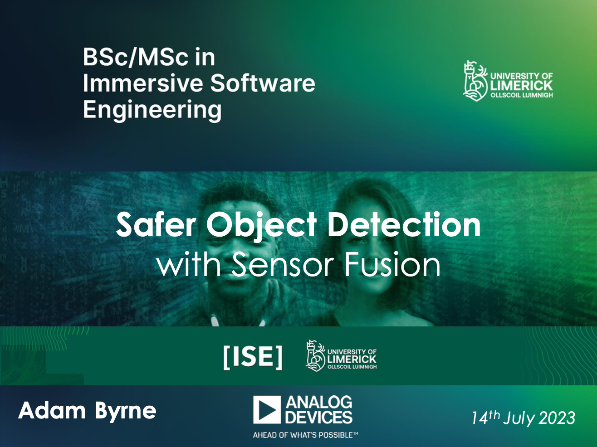

As part of my [Immersive Software Engineering](https://software-engineering.ie) course I completed my first Residency as part of the **Industrial Automation and Robotics team**. Following the _learn by doing_ approach I gained valuable experience in Computer Vision and Sensor Fusion working with a very talented team to bring **Industry 4.0** one step closer.

## 3D Time of Flight

I worked with the [3D Time of Flight (ToF)](https://www.analog.com/en/applications/technology/3d-time-of-flight.html) by ADI which is a type of scannerless LIDAR (light detection and ranging) that uses high power optical pulses in durations of nanoseconds to capture depth information (typically over short distances) from a scene of interest.

## Robotic Teleoperation

I worked on many tasks on residency but my main contribution was in the Robotic Teleoperation project where the goal was to create an application to allow a human to operate a robotic arm from anywhere in realtime.

The application of this technology is for assembly lines to reduce downtime by operating singular arms quickly without shutting everything down.

We used Infrared imaging to track a human wrist and using the ToF sensor gained 3D world coordinates of the wrist. These coordinates were tracked and fed into an Inverse Kinematics solver to mirror the wrist movement in realtime.

## Safer Object Detection

Part of my reporting requirements was to deliver a Webinar to my course colleagues about a topic I learned about while working on Residency.
I delivered a presentation exploring the improvement of Object Detection using Sensor Fusion by bringing a 3D element to the environment via the [3D Time of Flight (ToF)](https://www.analog.com/en/applications/technology/3d-time-of-flight.html) sensor.

For industrial applications the most meaningful improvement is fault tolerance and reliability as the data loses its single point of failure status as it is composed of multi-sensor data and model accurracy is also improved as common issues such as partial occlusions and other environmental factors such as lighting changes or moisture.
