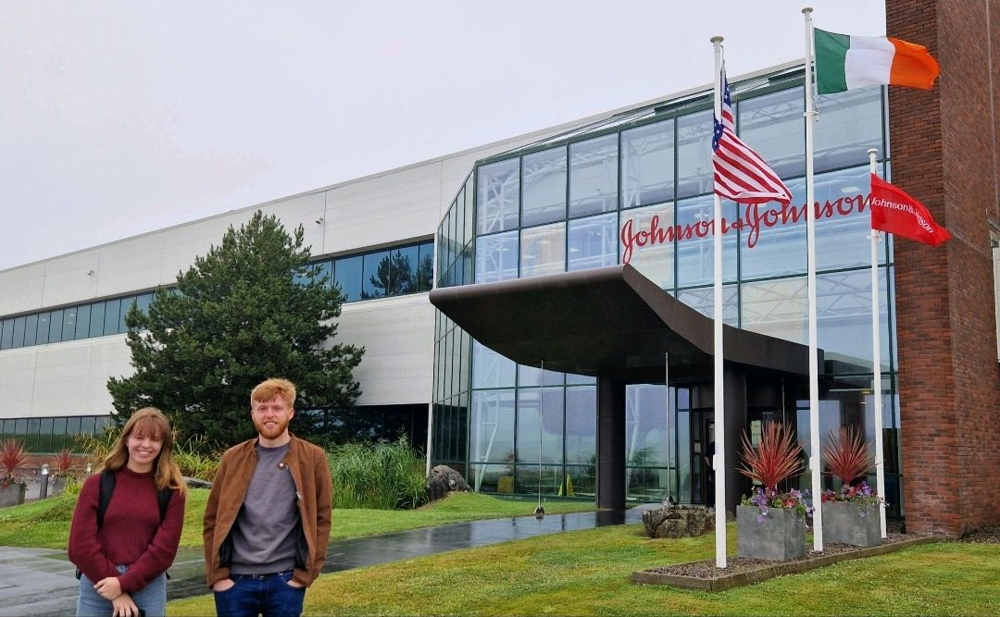

My 3rd residency as part of [Immersive Software Engineering](https://software-engineering.ie)  was with [Johnson & Johnson](https://jnj.com) where I worked on the Cloud delivery team for the [PAS-X](https://www.koerber-pharma.com/en/solutions/software/werum-pas-x-mes-suite) MES system from Körber and I also worked on inspection tooling for the MedTech manufacturing line on the EVA project. 

## PAS-X MES Cloud delivery

Pharma 4.0 is the next generation of Pharma manufacturing and the PAS-X MES system is a key component of this. I worked on the Cloud delivery team to deliver the PAS-X MES system to the cloud. This system encompasses the entire manufacturing process from raw materials to finished product and is used by many of the top Pharma companies in the world. 

I worked on the monitoring tooling via Open-Source tools such as Prometheus and Grafana to monitor the PAS-X MES system in the cloud. I also implemented some key changes for authentication and authorisation across live environments which involved working with sites and their IT teams to ensure a smooth transition and minimal downtime.

A very interesting application of this system is the CAR-T cell therapy which is a revolutionary treatment for cancer. The PAS-X MES system is used to track the entire manufacturing process from the patient to the finished product and is a key component in the success of this treatment.

## EVA inspection tooling

The EVA project is a shop-floor software for managing inspections on CMM machines. A lot of sites use different MES systems and a key issue was this integration. I developed a service that abstracted this, and exposed a REST API for the EVA project to consume. 

This service was developed in Go and was deployed to the cloud using Docker and Kubernetes to the Azure Cloud using services for key management and authentication. I implemented lots of automation such as testing and linting within the CI/CD pipeline to ensure the service was robust and reliable and even better I automated the documentation (build would fail if this was not up to date) via Swagger allowing the devs who needed to use to test it and have a clear understanding of the API.

## Reflection
I had a fantastic 10 weeks and a great visit to DePuy Synthes to see the hip and knee implant manufacturing in action. Although this placement was a short one I managed to learn a lot about the Pharma and MedTech manufacturing space and the challenges that come with it!

A special thanks to Brian Reynolds, John McKeogh and James Walsh for all their support throughout my placement!
