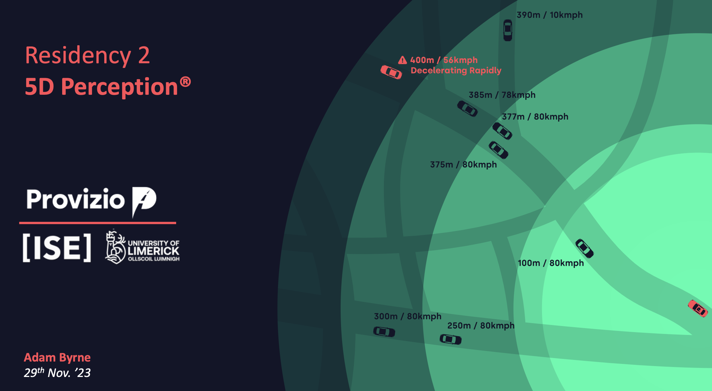

My 2nd residency as part of [Immersive Software Engineering](https://software-engineering.ie)  was with [Provizio](https://provizio.com) where I worked on Radar Perception for ADAS. I worked on the AI/ML team developing the radar only AI chain for classification, tracking and freespace segmentation for autonomous vehicles. I learned about edge deployment, optimising inference for NVIDIA hardware and model experimentation using technologies such as OpenCV, ONNX, PyTorch and TensorRT.

## Parallelised k-fold cross validation

I developed a parallelised k-fold cross validation framework for training and evaluating models. This framework allowed us to train and evaluate k splits on k GPUs in parallel. This framework was used to train and to provide more robust evaluation metrics for model selection.
I expanded this training tooling to include live and in-retro monitoring of each training split using Tensorboard.

## SAHI ONNX runtime support

I integrated the [SAHI (Slice Aided Hyper Inference)](https://github.com/provizio/apt_sahi) inference process for the ONNX runtime into the AI processing chain to allow the model to detect small objects to a high degree of accuracy which also helps stabilise tracking by conducting inference over a sliding window over the initial window with configurable overlap for false positive avoidance, SAHI is a derivation of tiling and provides a sliding window similar to techniques used in time-series analysis. SAHI is an open-source project and is available on GitHub under [obss/sahi](https://github.com/obss/sahi) based on the research published in the IEEE 2022 International Conference titled [Slicing Aided Hyper Inference and Fine-Tuning for Small Object Detection](https://ieeexplore.ieee.org/document/9897990).

## Performance profiling

Naturally running many inferences on one image with the SAHI method will lead to performance bottlenecks so to identify where improvements could be made I created a profiling tool which abstracts cProfile and provides a simple decorator to profile functions. This tool was used to identify bottlenecks in the AI chain and to identify where improvements could be made with signature targeting and profiling filtering for native functions and external libraries.

If you are profiling anything with heavy GPU usage w.r.t memcpy a good place to start is with the scalene tool which is a profiler for Python code that uses statistical sampling, it is available on GitHub under [plasma-umass/scalene](https://github.com/plasma-umass/scalene).

## 5D Perception™️

Part of my reporting requirements was to deliver a Webinar to my course colleagues about my residency. I delivered a presentation exploring the application of Radar based perception over other sensors such as LiDAR, stereo cameras and monocular cameras. I also explored the benefits of using Radar in conjunction with other sensors to create a more robust perception stack.

The TL;DR is that Radar provides vision through heavy rain and fog over a much longer range (~1km cocoon around the ego vehicle) than other sensors. Radar is also much cheaper than LiDAR, not affected by the sun or darkness as cameras are and also much more robust to occlusion than other sensors which is what seperates Provizio from other companies in the ADAS space.

## Reflection

I had a fantastic time at Provizio and I learned a lot about the ADAS space and the challenges that come with it. A special thank you to the team and especially my mentor Clément Botty for all the help and guidance throughout my residency and for the opportunity to work in Paris for a few weeks.
