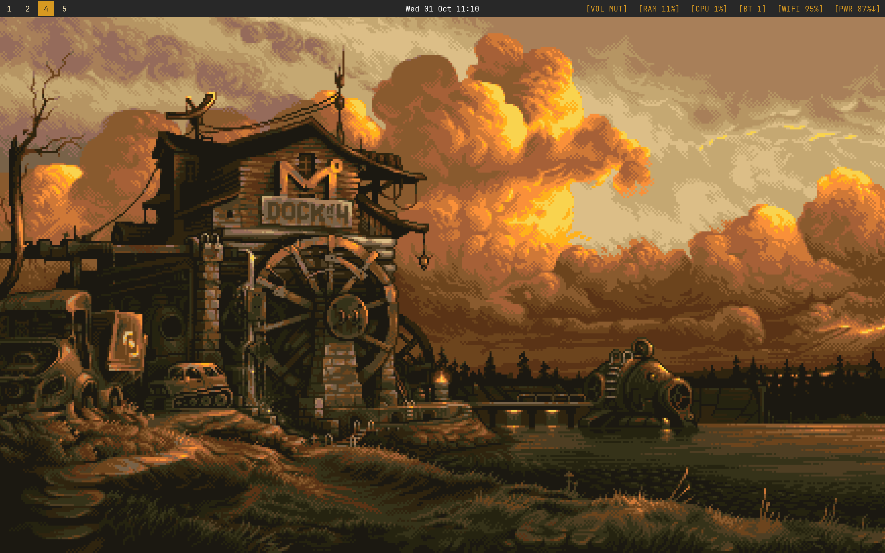

---
title: "dev setup (arch)"
description: "Mac is now Arch..."
date: "Oct 1 2025"
demoURL:  "https://github.com/bxrne/dotfiles/tree/master"
repoURL: "https://github.com/bxrne/dotfiles/tree/master"
--- 

> TL;DR Arch's complexity of use is overhyped, its easy to figure out (great docs) 

Every year something to the tune of "this is the year of the Linux Desktop" pops up, you probably say the omakase distributions from DHH like [omarchy](https://omarchy.org) bringing a plug and play dev machine up from ~3 minutes (some at <1min), and getting more people using Linux. This is all shrouded in tech twitter back and forth but that aside its a great way to revive struggling machines.

I'd been Mac for years (hand me downs) and as they aged and Apple shipped their updates they fall over eventually, say 5/6 years ago I moved a 2016 MacBook Pro over to Ubuntu and it was like a brand new machine. Currently on a 2019 MBP, had been messing with NixOS and Arch on VMs before making a decision (tried it on a cheap second hand thinkpad which will be left for a future cluster project) and ended up going with Arch. NixOS seemed like a larger time sync and their own language did not appeal to me as strongly as Linux (the tools I am used to).

# Why?

If you want to learn more about your machine and how the plumbing works this is a great exercise, its not that you will be a better dev or anything (you'll learn lots for sure) but its that you can customise your machine and make it fit your needs. Though I noticed a hilarious resource improvement after the change: Got rid of ~220GB of 'updates' from Cupertino and my battery life which was terrible but now my then desktop (in a laptop shape) was indeed a laptop. RAM and CPU improvements also. But mainly things opened straight away and I did not have to deal with animations (deliberate slowdowns that I don't care for).

Two things I wanted out of this:

- Key based navigation
- Nicer theming

I write code in neovim and would like to use my computer in a similar fashion. I went with a Wayland and Hyprland setup (Display server / Protocol and Compositor respectively) which once you get used to - you will find the point-and-click setups like a foreign language.

Primarily I only use a terminal (alacritty) and a browser (chromium), I need a file/bluetooth/wifi manager (most of which can be sourced as TUIs).
System menus and Screen capture menus are easy enough to do with a script in Hyprland.

I use basic yellow focused gruvbox theme with JetBrains Mono as my font.

# Omarchy?

Its an opinionated ready to go distro of Arch Linux, they have an ISO ready to boot from and a nice welcome menu to pick and choose some smaller details.
This is great and if given the option for a corporate machine I would use this (FIDO key ready etc) - reduces messing time.

But for my own machine I wanted to do it from scratch.

This is also a great way to revive a bunch of Mac Minis or MBPs that are stuck on the white line boot progress bar or just feeling slow, those machines are expensive and valuable hardware - which Linux seems to make better use of (power management is an issue but the resource use is less regardless). 

# T2 Madness

Any Mac pre 2019 (inc.) probably has the T2 Security chip so you can't use the Arch Linux ISO out of the box. You follow [this](http://wiki.t2linux.org/distributions/arch/installation/) great guide to use a patched kernel. Note: you cannot use the `archinstall` TUI here - do it via the manual commands.

The main issue here is the missing firmware for the broadcom WiFi chip and keyboard. So you install arch and add the T2 package databases and switch over.
You edit your kernel parameters to mesh well with the Intel MMU and GPU (integ.).

It's not the most straightforward process, but you can always chroot across and fix things pretty easily.
You may need a wired keyboard until its done.

# Houston, we have sound

I've done this 3 times now and on the third go I had no bluetooth or audio. This was a case of installing the servers for both and checking if the devices (speaker, HDMI) are detected. The docs are really good on all this stuff so it was relatively easy.

Anyway got sound playing after 20min of conflicting package surgery.

# The eduroam problem

If you are in university or school, odds are they have an eduroam network as the main one for you to use.
It uses the [8021x](https://en.wikipedia.org/wiki/IEEE_802.1X) authentication mechanism. I use `iwd` to manage my network connections so you have to create the eduroam file `eduroam.8021x` file in your `/var/lib/iwd/` folder.

The network I had to use, produced an interesting problem others on forums did not have, anonymous auth.
The mechanism used the PEAP method, you had to pass a hardcoded unassigned anonymous@... email first and use your directory email and pass for the login itself.

# Tooling

- Wofi - app launcher
- Waybar - Top bar
- ly - login screen 
- Hyprland - hyprlock, hyprpaper
- Grim - screenshots/videos
- blueberry - Bluetooth manager 
- wiremix - Audio manager 
- Impala - network manager 
- Nvim - text editor 
- Chromium - browser
- Bash - with starship prompt
- Alacritty - terminal emulator
- Mako - notifications

# But that app doesn't work on Arch! 

Unlikely there is not a package for it but if so you can just run the web version!
Either in browser or run `chromium --app=<url>` to get just the viewable frame (no toolbar/tabs), often for Microsoft apps (realtime collab especially) this is a better bet and you can keep your machine electron free!

# Summary

I did not explore the specific tools I use that much, if you're interested check the repo.
Last dev setup post was on both sides of the fence but this is a more refined setup.
I also mentioned before that this costs a lot of time (that you could be doing stuff) - and it does but not as much as you think, it does pay off (in a similar fashion to how faster network/resources make working on a codebase a bit faster).
