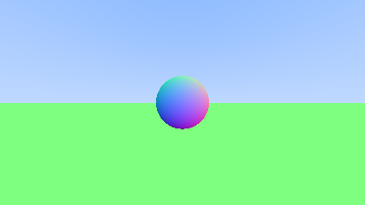

After some time dabbling with graphics, I decided to follow along with Peter Shirley's "Ray Tracing in One Weekend" guide, but implementing it entirely in OCaml instead of C++. An exercise for getting more familiar with OCaml.

## Why OCaml?

Implementing a ray tracer in OCaml is a natural fit. The guide often recommends techniques which lend themselves well to FP: immutable data structures, recursive ray tracing, and pattern matching on geometric types (OCaml has great expressivity via ADTs).

The trade-off, of course, is speed. A production ray tracer needs every millisecond of performance it can get. But for learning the concepts, OCaml forced me to think more about the mathematical side rather than optimising for speed.

Currently, lumen implements the foundational chapters of the guide. We have:

- Basic vector mathematics (addition, subtraction, dot products, cross products)
- Ray representation and ray casting from a camera
- Sphere intersection logic using the quadratic formula
- Plane intersection for a ground surface
- PPM image format output for rendering

This covers roughly the first third of the guide. The next topics are: materials, diffuse reflection, metal surfaces, and dielectrics.

## The Maths

Ray tracing starts with a deceptively simple question: for each pixel on the screen, what colour should it be? The answer requires tracing a ray from the camera through that pixel into the scene and determining what it hits.

### Ray Representation

A ray is represented as a function: **P(t) = A + tb**, where **A** is the origin, **b** is the direction, and **t** is a parameter representing distance along the ray. All values are three-dimensional vectors.

```
P(t) = A + tb
```

In the lumen code, this becomes:

```ocaml
type t = {
  origin: Vec.t;
  direction: Vec.t;
}
```

### Sphere Intersection

To determine if a ray hits a sphere, we substitute the ray equation into the sphere equation and solve for **t**. A sphere centred at **C** with radius **r** satisfies:

**(P - C) · (P - C) = r²**

Substituting the ray equation:

**(A + tb - C) · (A + tb - C) = r²**

This expands to a quadratic equation in **t**:

**t² b·b + 2t(A-C)·b + (A-C)·(A-C) - r² = 0**

Or in standard form: **at² + bt + c = 0**

The discriminant **b² - 4ac** tells us whether the ray intersects the sphere:

- Discriminant < 0: No intersection
- Discriminant = 0: Ray is tangent to the sphere
- Discriminant > 0: Two intersection points

We use the smaller positive **t** value (the nearest intersection):

```
t = (-b - sqrt(discriminant)) / (2a)
```

### Surface Normals

Once we know an intersection point, we need the surface normal, a vector perpendicular to the surface. For a sphere, the normal at any point **P** is simply:

**N = (P - C) / r**

The normal direction is crucial for calculating lighting, determining reflection directions, and defining material properties. By convention, normals point outward from the surface.

### Viewing Different Ray Parameters

One elegant aspect of the ray tracing approach is that we can visualise intermediate calculations. The current implementation displays a gradient based on the surface normal's **y**-component:

```ocaml
let t = 0.5 *. (normal.y +. 1.0) in
Color.create (255.0 *. t) (255.0 *. t) (255.0 *. t)
```

This maps **y**-coordinates from [-1, 1] to colours from black to white. This visualisation helped validate that normal calculations were correct before moving to more complex material interactions.

## The PPM Format

The guide starts with the simplest possible image format: PPM (Portable Pixmap). It's a plain text format where each pixel is represented as three integers (red, green, blue values from 0 to 255).

Lumen generates PPM files directly, which can be opened in most image viewers or converted to PNG/JPEG using standard tools. This simplicity makes it trivial to verify output and debug rendering issues.

## Functional Approach to Scene Composition

The guide builds scenes by storing objects in a list and iterating through them for intersection tests. In lumen, we use an algebraic data type to represent hittable objects:

```ocaml
type hittable_obj =
  | Sphere of sphere
  | Plane of plane
```

When testing a ray against the scene, we pattern match on each object type and dispatch to the appropriate intersection test. This is far cleaner than C++'s virtual function approach and statically guarantees we handle all object types.

## Left to implement

1. **Materials system**: Different surfaces (diffuse, metal, glass) that scatter rays differently
2. **Monte Carlo sampling**: Multiple rays per pixel for antialiasing and realistic lighting
3. **Path tracing**: Recursive ray bouncing for indirect illumination
