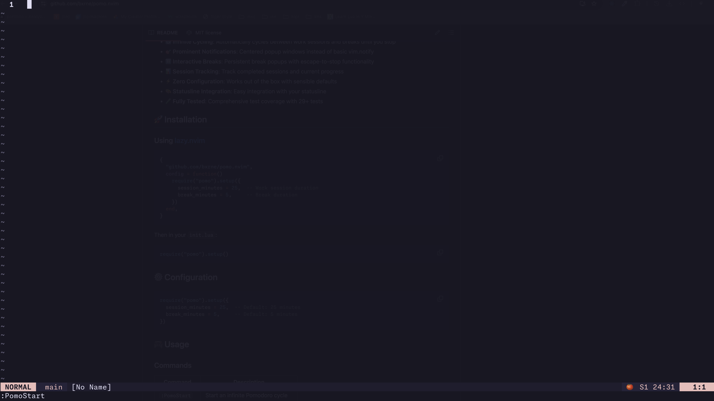

Inspired by the [Pomodoro Technique](https://en.wikipedia.org/wiki/Pomodoro_Technique), this Neovim plugin helps you manage your time effectively by breaking your work into intervals, traditionally 25 minutes in length, separated by short breaks (usually 5 minutes).

## Features

- **Customizable Timers**: Set your own work and break durations.
- **Notifications**: Get notified when your work or break time is over.
- **Session Management**: Keep track of your completed pomodoros.
- **Easy Integration**: Works seamlessly with Neovim's built-in notification system (and lualine).
- **Minimal Setup**: Simple configuration to get started quickly.

## Installation

To install `pomo.nvim`, you can use your favorite plugin manager. Here are examples:

### Using `lazy.nvim`

```lua
{
  "bxrne/pomo.nvim",
  config = function()
    require("pomo").setup({
      session_minutes = 25, -- Duration of work session in minutes
        break_minutes = 5, -- Duration of break in minutes
        })
  end,
}
```

### Using `packer.nvim`

```lua
use {
  "bxrne/pomo.nvim",
  config = function()
    require("pomo").setup({
      session_minutes = 25, -- Duration of work session in minutes
      break_minutes = 5, -- Duration of break in minutes
    })
  end,
}
```

### Using `vim-plug`

```vim
Plug 'bxrne/pomo.nvim', { 'do': ':PomoSetup' }
```

## Usage

After installation, you can start a pomodoro session by running the command:

```vim
:PomoStart
```

You can also stop the current session with:

```vim

:PomoStop
```

You can check the status of your current session with:

```vim
:PomoStatus
```

You can reset the current session with:

```vim
:PomoReset
```

A short local function can get the #sessions and current stats in your Neovim status line (See README).
It loops infinitely and stays out of your way (can ignore breaks).


