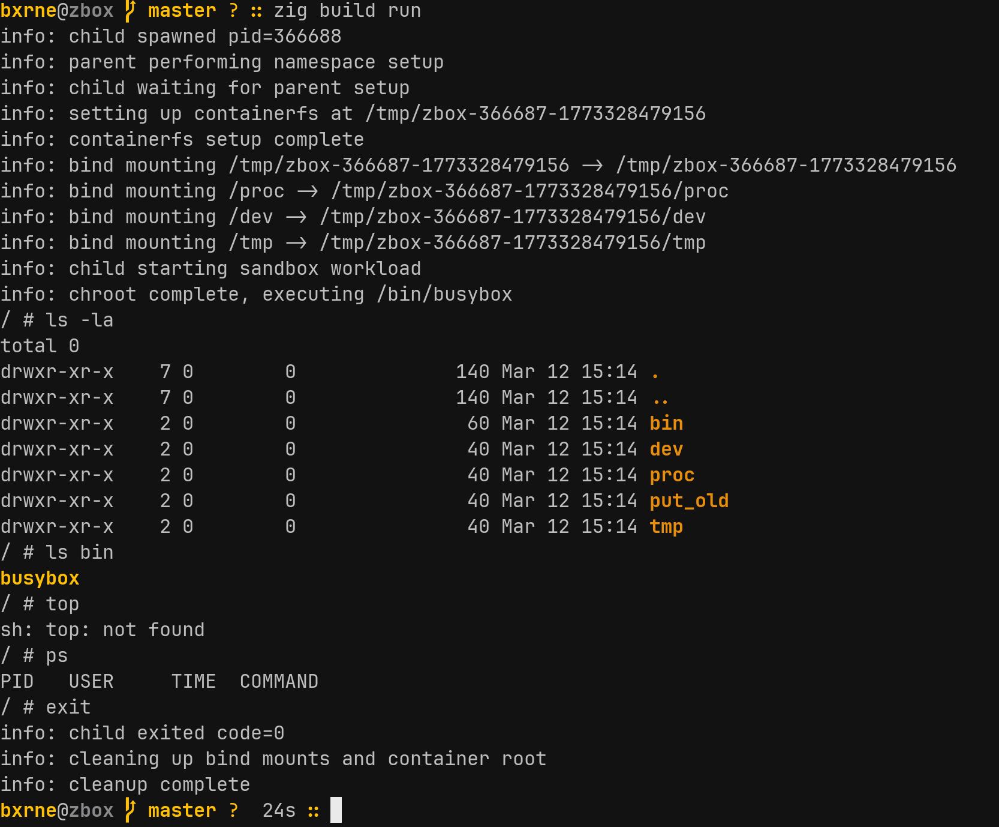

zbox is a rootless Linux sandbox written in Zig. It isolates a process using kernel namespaces and gives it a fresh filesystem, without needing sudo. The sandboxed process thinks it is root. The host is unaffected.

This started as an exercise in understanding what containers actually do at the syscall level. Docker, Podman, and the rest sit on top of the same Linux primitives. zbox uses them directly.

## Why Zig?

Zig gives you direct access to Linux syscalls without going through libc. Calling `clone`, `mount`, `chroot` is just function calls into `std.os.linux`. There is no runtime, no garbage collector, and the output is a small static binary. For something that needs to set up namespaces and manipulate `/proc` files, this is a natural fit.

## Namespaces

Linux namespaces let you create isolated views of system resources. A process in a new namespace sees its own version of something (mount table, hostname, user IDs) while the host's version stays untouched.

There are seven namespace types. zbox currently uses three:

| Namespace | Isolates                | Flag            |
| --------- | ----------------------- | --------------- |
| User      | UID/GID mappings        | `CLONE_NEWUSER` |
| Mount     | Filesystem mount points | `CLONE_NEWNS`   |
| UTS       | Hostname                | `CLONE_NEWUTS`  |

The user namespace is the important one for rootless operation. It lets you map container UID 0 (root) to your host UID (say 1000). The container process believes it has root privileges. The kernel knows it does not.

## How It Works

The lifecycle is short:

1. Parse CLI arguments, build a `Sandbox` struct
2. `clone()` a child process with namespace flags
3. Parent sets up the environment while child waits on a pipe
4. Parent signals the child, child enters the sandbox

The `clone()` call is where the isolation begins. It creates a new process that lives in fresh user, mount, and UTS namespaces:

```zig
const clone_flags =
    linux.CLONE.NEWUSER |
    linux.CLONE.NEWNS |
    linux.CLONE.NEWUTS |
    linux.SIG.CHLD;
```

After cloning, the parent does the setup work. It writes UID/GID maps to `/proc/PID/uid_map` and `/proc/PID/gid_map`, creating the mapping between container root and the real user. It also writes `deny` to `/proc/PID/setgroups` to prevent the child from calling `setgroups()` and escaping the mapping.

Then the parent builds a throwaway filesystem under `/tmp/zbox-*/` and bind mounts `/proc`, `/dev`, and `/tmp` into it. The child gets a working system view without touching the host.

## The Child Process

The child blocks on a pipe read until the parent signals that setup is complete. Then it does three things:

1. `chdir()` to the container root
2. `chroot()` to make that directory the new `/`
3. `execve()` busybox to replace itself with a shell

After `execve`, the child process is busybox running inside an isolated namespace with its own filesystem root. The parent calls `waitpid` and cleans up the bind mounts and temporary directory when it exits.

## Why Busybox?

Busybox is a single static binary (~1MB) that bundles sh, ls, cat, echo, and dozens of other utilities. Copying it into the container root means the sandboxed process has a usable environment without depending on host libraries or paths. It is the standard choice for minimal containers and embedded systems.

## Cleanup

After the child exits, zbox unmounts the bind mounts and deletes the temporary root directory. Each run starts clean with no leftover state.

## What Is Missing

**Interactive shell**: The child process currently runs but has no terminal connection. Wiring up stdin/stdout/stderr with pipes and `dup2()` would make it interactive.

**Network namespace**: Adding `CLONE_NEWNET` to the clone flags and setting up a veth pair would give the container its own isolated network stack.

**seccomp**: Syscall filtering with BPF would let you restrict what the sandboxed process can do. Block `reboot`, `mount`, `swapon` and similar calls that have no business running inside a sandbox.

**pivot_root**: `chroot` changes the root directory but does not fully isolate the mount namespace. `pivot_root` swaps the root mount and puts the old one somewhere you can unmount. This is what production container runtimes use.

**OCI compatibility**: Unpacking OCI image layers and implementing the runtime spec would let zbox run actual container images rather than just busybox.

## In Summary

zbox demonstrates the core mechanics behind Linux containers in around 300 lines of Zig:

| Concept              | Implementation                   |
| -------------------- | -------------------------------- |
| Process isolation    | `clone()` with namespace flags   |
| User isolation       | UID/GID mapping via `/proc`      |
| Filesystem isolation | `chroot()` + bind mounts         |
| Fresh filesystem     | Temporary `/tmp/zbox-*/` per run |
| Rootless operation   | User namespace mapping           |

The current version is a proof of concept. With interactive I/O, network namespaces, seccomp, and pivot_root it could serve as a foundation for a minimal container runtime.
